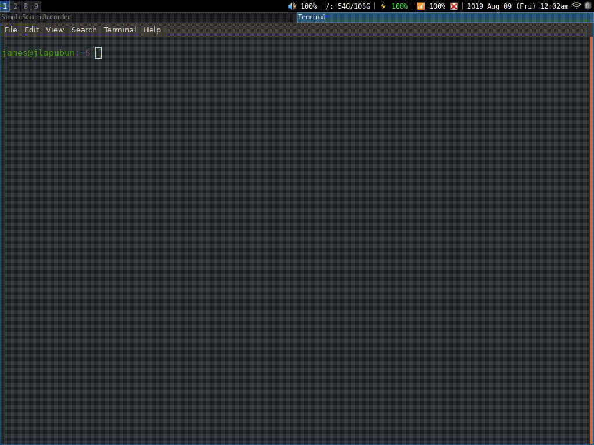

# config_displays

A simple shell script that allows the user to create xrandr commands through dmenu.
It is currently in a working state but could do with some more polish.

The demo does not demonstrate resolutions changing as I cannot find a screen recorder that works across resolution changes but trust me, it works. At least for me.

## Dependencies

- dmenu
- xrandr

## Install

Move config_displays to your desired location within $PATH (I use $HOME/bin/), ensure script has execute permissions (use `chmod +x config_displays` if not) and run the command through the terminal.

If you just want to test out the script then you can cd to where it resides and run it with `./config_displays` without you having to have it in your $PATH.

Optionally, I bound one of my FN keys on my laptop to run the command to make the function more accessible. I achieved this by adding: 
`bindsym XF86Display exec --no-startup-id config_displays "Display Mode"` to my i3 config ($HOME/.config/i3/config), change to a key of your preference and it should work fine.

## Future plans

- Options to go back a menu.
- Show relevant resolutions; currently not all resolutions are actually valid, despite xrandr displaying them.
- Improve aspect ratio algorithm to work better with weird ratio resolutions (e.g. 1366x768 returns 683:384)
- Find a way to filter out outputs xrandr shows but you don't have.
- Code optimisation.
- More stuff I haven't thought of yet.

## Assumed F.A.Q's

### *"The program is showing outputs I don't have; why is this?"*

That is due to xrandr's output and not from my script and I have no idea why it does that. Regardless, no resolutions will display under those outputs and the script will exit shortly after.

### *"I've noticed a bug or have some improvements to your code, what should I do?"*

You can always open an issue on the Issues tab, or if you have a fix, you may want to fork the project and propose a pull request of your fix.
All help is greatly appreciated.
