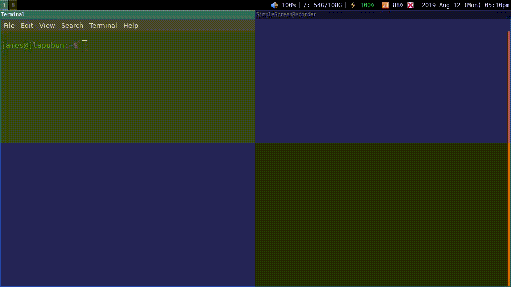

# config_displays

A simple shell script that allows the user to create xrandr commands through dmenu.
It is currently in a working state but could do with some more polish.

## Dependencies

- 'dmenu'
- 'xrandr'

## Install

Move config_displays to your desired location within $PATH (I use $HOME/bin/), ensure script has execute permissions (use `chmod +x config_displays` if not) and run the command through the terminal.

Optionally, I bound one of my FN keys on my laptop to run the command to make the function more accessible. I achieved this by adding: 
`bindsym XF86Display exec --no-startup-id config_displays "Display Mode"` to my i3 config ($HOME/.config/i3/config).

## Future plans

- Pressing escape sends you back a menu.
- Only show relevant resolutions; currently not all resolutions are actually valid, despite xrandr displaying them.
- Code optimisation.
- More stuff I haven't thought of yet.

## I've noticed a bug or have some improvements to your code, what should I do?

You can always open an issue on the Issues tab, or if you have a fix, you may want to fork the project and propose a pull request of your fix.
All help is greatly appreciated.
